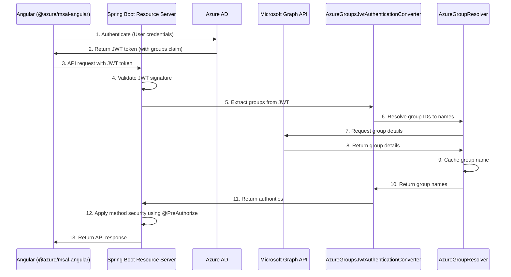

# Spring Boot 3.4 Resource Server with Azure OAuth2 Integration

## Project Overview

This project demonstrates a robust implementation of a Spring Boot 3.4 application configured as an OAuth2 resource server that integrates with Azure Active Directory for authentication and authorization. The application provides a RESTful API for managing products and categories with role-based access control driven by Azure AD group memberships.

## Key Components

### Authentication and Authorization

The application uses Azure AD as the identity provider and maps Azure AD group memberships to Spring Security roles. This is accomplished through several key components:

1. **SecurityConfig**: Configures Spring Security with JWT authentication, CORS settings, and endpoint security rules.

2. **AzureGroupResolver**: Interfaces with Microsoft Graph API to resolve Azure AD group IDs to human-readable names and cache the results for performance.

3. **AzureGroupsJwtAuthenticationConverter**: Extracts group claims from JWTs and converts them to Spring Security GrantedAuthority objects.

4. **GroupIdToNameConverter**: Provides a mapping from Azure AD group IDs to role names used internally by the application.

### RESTful API Controllers

The application exposes several RESTful API endpoints:

1. **CategoryController**: Manages CRUD operations for product categories with role-based access control.
   - Retrieving categories is allowed for users with ADMIN, USER, or VIEWER roles
   - Creating categories requires the ADMIN role
   - Updating categories requires either ADMIN or EDITOR roles
   - Deleting categories requires the ADMIN role

2. **ProductController**: Manages CRUD operations for products, with endpoints for filtering by category, name, and price.

3. **AuthTestController**: Provides test endpoints for verifying authentication and authorization functionality.

4. **HomeController**: Redirects to Swagger UI documentation.

### Domain Model

1. **Category**: Represents a product category with a name, description, and associated products.

2. **Product**: Represents a product with a name, description, price, image URL, and associated category.

3. **UserProfile**: Data transfer object representing user information from Azure AD.

### Swagger Documentation

The application provides comprehensive API documentation using OpenAPI 3 (Swagger) with integration for OAuth2 authentication flow.

### Data Initialization

The `DataInitializer` class populates the database with sample categories and products for testing purposes.

## Technical Architecture

### Authentication Flow



## Key Technical Implementations

### JWT Processing

The application processes JWTs issued by Azure AD, extracting claims like:
- Subject identifier
- Username
- Group memberships
- Email
- Object ID
- Tenant ID

### Role-Based Access Control

The application implements a sophisticated role-based access control system that:
1. Extracts Azure AD group IDs from the JWT token
2. Resolves group IDs to human-readable group names using Microsoft Graph API
3. Maps these group names to internal roles with the prefix "ROLE_"
4. Uses Spring Security's `@PreAuthorize` annotations to enforce access control at the method level

### Group Name Resolution and Caching

The application includes an efficient caching mechanism for Azure AD group name resolution:
1. First checks an in-memory cache for previously resolved group names
2. If not found, calls Microsoft Graph API to fetch group details
3. Formats the group name with the "ROLE_" prefix and caches it for future use
4. Falls back to a default naming convention if the API call fails

### API Documentation

The OpenAPI configuration provides comprehensive documentation with:
1. Detailed endpoint descriptions
2. Request/response schema documentation
3. Authentication requirements
4. Integration with Azure AD OAuth2 flow for interactive testing via Swagger UI

## Enterprise-Grade Features

1. **Stateless Architecture**: Uses JWT-based authentication for a stateless, scalable design
2. **Caching Strategy**: Implements caching for Azure AD group resolution to minimize external API calls
3. **Comprehensive Error Handling**: Returns appropriate HTTP status codes and error messages
4. **Swagger Documentation**: Provides interactive API documentation with OAuth2 integration
5. **Role-Based Access Control**: Fine-grained authorization at the endpoint level
6. **Pagination Support**: Implements pagination for endpoints returning large collections
7. **Flexible Sorting**: Allows sorting of results by various fields
8. **CORS Configuration**: Configurable CORS settings for cross-origin requests
9. **Custom Authentication Entry Point**: Custom handling of authentication failures

## Microservice Design Patterns

This application demonstrates several microservice design patterns:

1. **API Gateway Pattern**: Provides a unified API surface for client applications
2. **Circuit Breaker Pattern**: Can be extended with resilience patterns for external API calls
3. **Configuration Externalization**: Uses environment variables and properties for configuration
4. **Service Discovery Integration**: Ready for service discovery integration in a larger ecosystem
5. **Authentication Delegation**: Delegates authentication to Azure AD
6. **Resource Server Pattern**: Focuses on resource protection and authorization

## Application Configuration

The application is configured using Spring Boot's `application.properties` file:

```properties
spring.application.name=simpleapi

# H2 Database Configuration
spring.datasource.url=jdbc:h2:mem:productdb
spring.datasource.driverClassName=org.h2.Driver
spring.datasource.username=sa
spring.datasource.password=password
spring.jpa.database-platform=org.hibernate.dialect.H2Dialect
spring.h2.console.enabled=true
spring.h2.console.path=/h2-console

# JPA Configuration
spring.jpa.hibernate.ddl-auto=update
spring.jpa.show-sql=true

# OpenAPI Configuration
springdoc.api-docs.path=/api-docs
springdoc.swagger-ui.path=/swagger-ui.html
springdoc.swagger-ui.operationsSorter=method

# CORS Configuration
spring.web.cors.allowed-origins=http://localhost:4200
spring.web.cors.allowed-methods=GET,POST,PUT,DELETE,OPTIONS
spring.web.cors.allowed-headers=*
spring.web.cors.allow-credentials=true

# Azure AD OAuth2 Configuration
spring.security.oauth2.resourceserver.jwt.issuer-uri=https://login.microsoftonline.com/${AZURE_TENANT_ID}/v2.0

# Logging for OAuth2 (useful for debugging)
logging.level.org.springframework.security=DEBUG
logging.level.org.springframework=DEBUG
logging.level.org.springframework.security.oauth2=DEBUG
logging.level.com.azure.identity=DEBUG

# Azure AD Application properties for Microsoft Graph API
azure.tenant-id=${AZURE_TENANT_ID}
azure.client-id=${AZURE_CLIENT_ID}
azure.client-secret=${AZURE_CLIENT_SECRET}
# Microsoft Graph API
microsoft.graph.scope=https://graph.microsoft.com/.default
```

Key configuration elements include:
1. H2 in-memory database for development and testing
2. JPA configuration for entity management
3. OpenAPI/Swagger documentation paths
4. CORS configuration for Angular frontend
5. Azure AD OAuth2 resource server configuration
6. Debug logging for security components
7. Azure AD application properties for Microsoft Graph API access

## Conclusion

This Spring Boot 3.4 application demonstrates a modern, enterprise-grade implementation of a resource server with Azure AD integration. It showcases best practices for OAuth2 security, API design, and role-based access control in a microservice architecture. The combination of Spring Security, Azure AD, and Microsoft Graph API provides a powerful and flexible security model suitable for complex enterprise applications.
