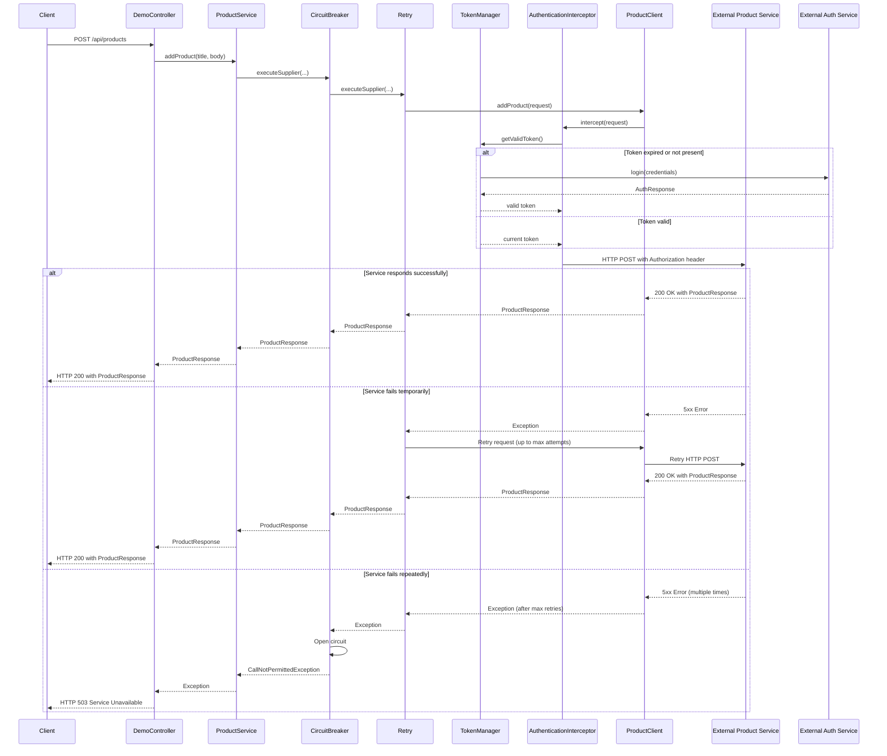

# Spring Boot Microservice with RestClient and Resilience Patterns

This project demonstrates a modern Spring Boot microservice architecture that showcases the use of Spring's RestClient
for HTTP communication and Resilience4j for fault tolerance patterns.

## Architecture Overview

This application is built as a microservice that communicates with external services (authentication and product
services) using Spring's RestClient. It implements robust fault tolerance patterns to ensure reliability and resilience
in distributed systems.

### Key Components

- **Spring Boot 3.x**: Foundation framework providing auto-configuration and embedded server
- **Spring RestClient**: Modern HTTP client for service-to-service communication
- **Resilience4j**: Fault tolerance library implementing circuit breaker and retry patterns
- **IBM MQ**: Message broker for asynchronous communication (optional component)

### Architectural Patterns

- **Declarative HTTP Clients**: Using Spring's HTTP interfaces for clean API client definitions
- **Circuit Breaker Pattern**: Preventing cascading failures by stopping calls to failing services
- **Retry Pattern**: Automatically retrying failed operations with exponential backoff
- **Token-based Authentication**: Secure service-to-service communication with JWT tokens
- **Centralized Exception Handling**: Consistent error responses using RFC 7807 Problem Details

## Sequence Diagram

The following diagram illustrates the typical flow of a request through the system:



## RestClient Implementation

This project uses Spring's RestClient (introduced in Spring Framework 6.1) which provides a modern, fluent API for HTTP
requests. Key features of our implementation:

### Declarative HTTP Interfaces

Instead of manually constructing HTTP requests, we define Java interfaces with annotations:

```java

@HttpExchange
public interface ProductClient {
    @PostExchange
    ProductResponse addProduct(@RequestBody ProductRequest request);
}
```

Spring automatically generates implementations of these interfaces at runtime.

### Client Configuration

The RestClient is configured with error handling, logging, and authentication:

```java
RestClient restClient = RestClient.builder()
        .baseUrl(productUrl)
        .requestInterceptor(authInterceptor)
        .defaultStatusHandler(
                httpStatus -> httpStatus.isError(),
                (request, response) -> {
                    // Error handling logic
                }
        )
        .build();
```

### Authentication Interceptor

A custom interceptor adds authentication tokens to outgoing requests:

```java
public ClientHttpResponse intercept(HttpRequest request, byte[] body,
                                    ClientHttpRequestExecution execution) {
    if (isNotRequestingANewToken(request)) {
        request.getHeaders().add(
                HttpHeaders.AUTHORIZATION,
                "Bearer " + tokenManager.getValidToken()
        );
    }
    // Execute request and handle response
}
```

## Resilience Patterns

### Circuit Breaker Pattern

The circuit breaker prevents cascading failures by stopping calls to failing services:

```java
return productCircuitBreaker.executeSupplier(() ->
        // Service call
        );
```

Configuration in `application.properties`:

```properties
resilience4j.circuitbreaker.instances.productService.slidingWindowSize=10
resilience4j.circuitbreaker.instances.productService.failureRateThreshold=50
resilience4j.circuitbreaker.instances.productService.waitDurationInOpenState=10000
resilience4j.circuitbreaker.instances.productService.permittedNumberOfCallsInHalfOpenState=3
```

### Retry Pattern

The retry mechanism automatically retries failed operations with exponential backoff:

```java
return productRetry.executeSupplier(() ->
        // Service call
        );
```

Configuration in `application.properties`:

```properties
resilience4j.retry.instances.productService.maxAttempts=3
resilience4j.retry.instances.productService.waitDuration=1000
resilience4j.retry.instances.productService.enableExponentialBackoff=true
resilience4j.retry.instances.productService.exponentialBackoffMultiplier=2
```

### Combined Patterns

The patterns are combined in a specific order to maximize effectiveness:

```java
// Circuit Breaker (outer) → Retry (inner) → API Call
return productCircuitBreaker.executeSupplier(() ->
        productRetry.

executeSupplier(() ->
        productClient.

addProduct(request)
    )
            );
```

This ensures that:

1. Circuit breaker prevents retries when circuit is open
2. Retry attempts are made only when circuit is closed or half-open
3. Failure statistics are properly collected for circuit decision making

## Token Management

The `TokenManager` class handles authentication token lifecycle:

- Token acquisition through the authentication service
- Token caching to minimize authentication requests
- Thread-safe token renewal using locks
- Automatic expiration handling with buffer time
- Token invalidation when needed

## Exception Handling

The application uses RFC 7807 Problem Details for standardized error responses:

```java
ProblemDetail problemDetail = ProblemDetail.forStatusAndDetail(
        HttpStatus.SERVICE_UNAVAILABLE,
        "Service is temporarily unavailable due to excessive failures. Please try again later."
);

problemDetail.

setType(URI.create("https://api.example.com/errors/service-unavailable"));
        problemDetail.

setTitle("Service Temporarily Unavailable");
problemDetail.

setProperty("timestamp",Instant.now());
        problemDetail.

setProperty("errorId",errorId);
```

## Prerequisites

- Java 17 or higher
- Docker and Docker Compose (for IBM MQ)
- Gradle

## Getting Started

### 1. Start IBM MQ Container (Optional)

If you want to use the IBM MQ integration:

```bash
docker-compose up -d
```

### 2. Run the Spring Boot Application

```bash
./gradlew bootRun
```

## API Endpoints

### Authentication

```bash
curl -X POST "http://localhost:8080/api/login?username=user&password=pass&expiresInMins=30"
```

### Add Product

```bash
curl -X POST "http://localhost:8080/api/products?title=Product%20Name&body=Product%20Description"
```

### Demo Flow

```bash
curl -X POST "http://localhost:8080/api/demo"
```

## Configuration

The application can be configured through `application.properties`. Key configuration areas:

- External service URLs
- Resilience4j circuit breaker settings
- Resilience4j retry settings
- Authentication credentials

## Security Considerations

- Sensitive information is logged only at debug level
- Error responses are sanitized to prevent information leakage
- Authentication tokens are automatically refreshed before expiration
- Thread-safe token management prevents race conditions
