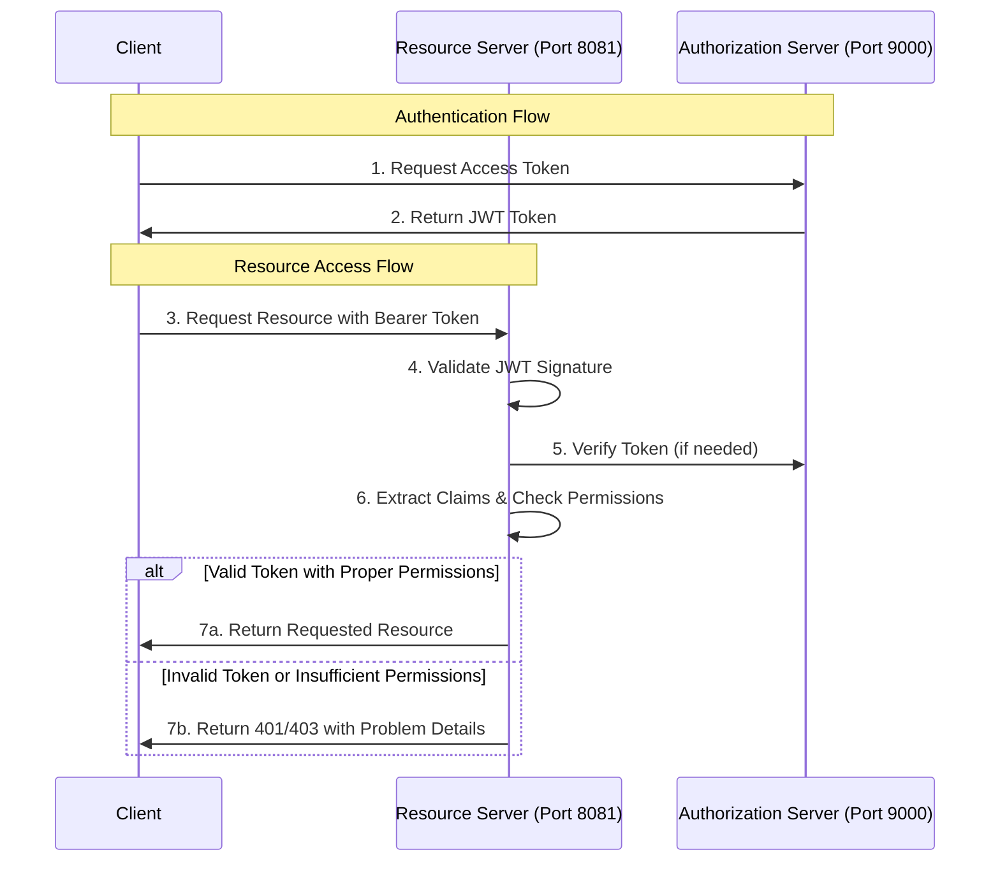

# Spring Boot OAuth2 Resource Server Implementation

## Project Overview

This project demonstrates a complete implementation of OAuth2 security in a Spring Boot application, focusing on JWT-based authentication with a Resource Server connecting to an Authorization Server. The architecture follows modern microservices principles with security best practices.

## Technical Stack

- **Java 17**: Latest LTS version with enhanced performance and features
- **Spring Boot 3.4.4**: Modern Spring framework with auto-configuration
- **Spring Security OAuth2**: For implementing the resource server
- **JWT Authentication**: Secure token-based authentication
- **SpringDoc OpenAPI**: API documentation with Swagger UI
- **Docker & Docker Compose**: Containerization and orchestration
- **Problem Details (RFC 7807)**: Standardized error responses

## Component Architecture

The project is structured as a microservices architecture with the following components:

### Authorization Server
- Runs on port 9000
- Issues and validates JWT tokens
- Manages user authentication and authorization

### Resource Server (API)
- Runs on port 8081
- Secures endpoints using JWT validation
- Validates tokens against the authorization server
- Serves protected resources based on authentication and authorization

## Key Implementation Details

### Resource Server Configuration

The `SecurityConfig.java` provides a robust OAuth2 resource server setup:

```java
@Configuration
@EnableWebSecurity
public class SecurityConfig {
    @Bean
    public SecurityFilterChain securityFilterChain(HttpSecurity http) throws Exception {
        http
            .authorizeHttpRequests(requests -> requests
                // Public endpoints for API documentation
                .requestMatchers("/swagger-ui/**", "/v3/api-docs/**").permitAll()
                // Secure all API endpoints
                .requestMatchers("/api/**").authenticated()
                .anyRequest().permitAll()
            )
            .oauth2ResourceServer(oauth2 -> oauth2.jwt());
        return http.build();
    }
}
```

### Comprehensive Exception Handling

The `SecurityExceptionHandler.java` implements sophisticated error handling for all OAuth2/JWT-related issues:

- Invalid tokens
- Expired tokens
- Malformed JWTs
- Signature verification failures
- Access denied scenarios

Each exception returns a standardized Problem Detail response conforming to RFC 7807, enhancing API usability.

### Docker Deployment

The project includes a multi-stage Dockerfile for efficient container builds and a docker-compose configuration for running the entire system:

```yaml
version: '3.8'
services:
  api:
    build:
      context: .
      dockerfile: Dockerfile
    container_name: simpleapi
    ports:
      - "8080:8080"
    networks:
      - app-network
    depends_on:
      - auth-server

  auth-server:
    image: maxiplux/simpleapi-authorization-and-resource-server:1.0.0
    container_name: auth-server
    ports:
      - "9000:8080"
    networks:
      - app-network
```

## Authentication Flow

The OAuth2 flow is visualized in the following sequence diagram:



## Security Best Practices Implemented

1. **Token Validation**: Comprehensive JWT validation covering signature, expiration, and claims
2. **Detailed Error Handling**: Specific error responses that don't leak sensitive information
3. **Standardized Problem Details**: RFC 7807 compliant error responses
4. **API Documentation**: Secured Swagger UI integration
5. **Separation of Concerns**: Distinct authorization and resource servers

## Running the Application

1. **Build the Application**:
   ```bash
   ./gradlew build
   ```

2. **Start with Docker Compose**:
   ```bash
   docker-compose up -d
   ```

3. **Access Points**:
    - Authorization Server: http://localhost:9000
    - Resource Server API: http://localhost:8080
    - Swagger Documentation: http://localhost:8080/swagger-ui.html
## Advanced Features

- **Problem Details**: RFC 7807 compliant error responses enhance API usability
- **Comprehensive JWT Validation**: Handles common security vulnerabilities
- **Rate Limiting Configuration**: Prevents abuse through configurable timeouts
- **Docker Multi-Stage Builds**: Efficient container images

## Technical Insights

This implementation follows industry best practices for securing microservices with OAuth2. The separation between authorization and resource servers creates a scalable security architecture that can support multiple resource servers with centralized authentication.

The JWT implementation provides a stateless authentication mechanism, eliminating the need for session management across services while maintaining security integrity through digital signatures and claims validation.